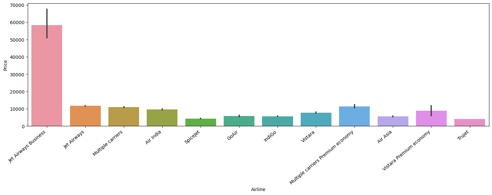
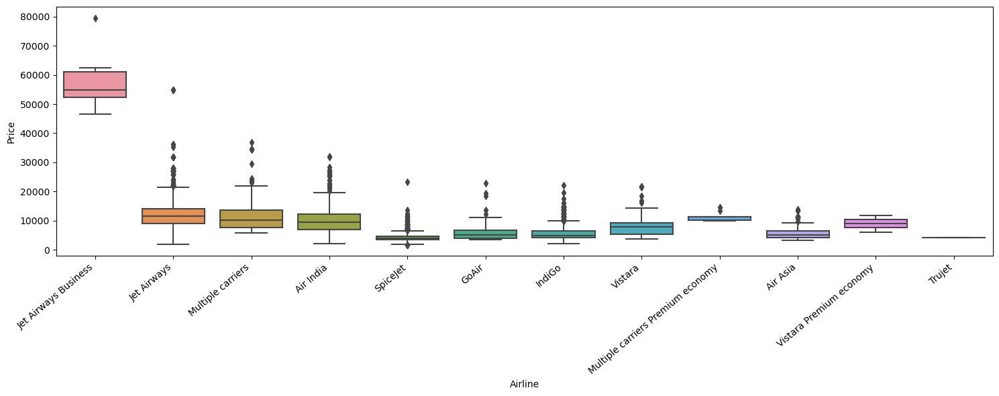
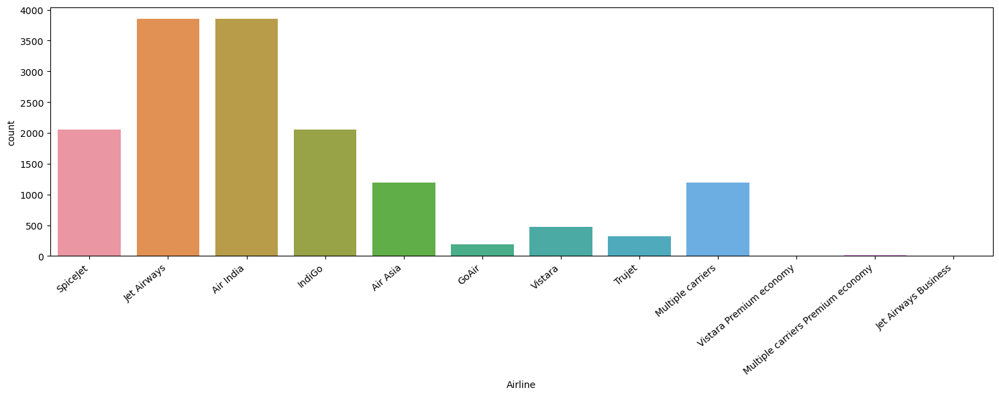

# Flight Price Prediction Analytics

## Overview

This project predicts airline ticket prices using machine learning techniques such as feature engineering, exploratory data analysis (EDA), and regression modeling.

## Tools Used

- Python
- Pandas
- NumPy
- Matplotlib
- Seaborn
- Scikit-Learn

## Workflow

- Data Cleaning
- Exploratory Data Analysis (EDA)
- Feature Engineering
- Model Building
- Model Evaluation

## Model Performance

| Model | RMSE | R² Score |
|---------|---------|---------|
| Linear Regression | 0.5364 | 0.6458 |
| Random Forest Regressor | 0.3937 | 0.8092 |

### Key Findings

- Flight duration significantly impacts ticket prices.
- Airline choice is a strong predictor of airfare.
- Random Forest outperformed Linear Regression.
- Feature engineering improved predictive performance.

## Visualizations

### Airline Price Analysis

### Ticket Price Distribution by Airline

### Route Analysis

### Model Performance

## Author

Zakariyya Shahid  
MS Business Analytics, University of Rochester
